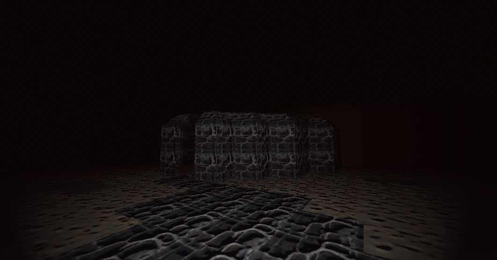
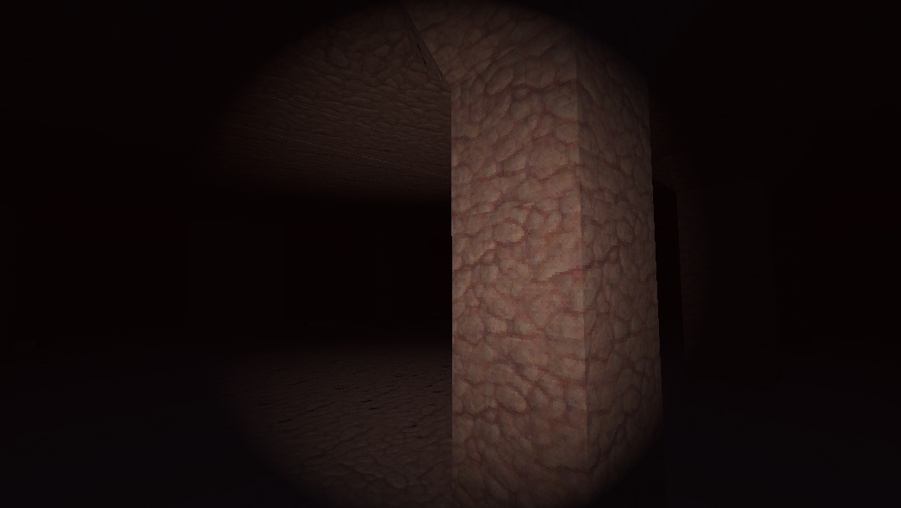

# Walking-Sim
 My personal game I am working on

## Features

As this is still a very crude work in progress I want to get the basic movement and collision down before I continue. So far I have implemented the following:

- Basic x and z axis movement
- y axis jumping
- Sprint movement
- Head bob visual on x and y axis
- On ground stopping inertia
- In air stopping Inertia
- Flashlight visual

## Screenshots

Currently there is only one tester stucture made out of assets that I have created on blender

This is the enterance to the structure

This is the main room inside of the structure

## Future plans

My next goal for this project is to implement a smoother player control system with the ability to sprint and jump at the same time. Mainly reworking the current movement system to smooth out the controls and to make the inertia function more like in real life.